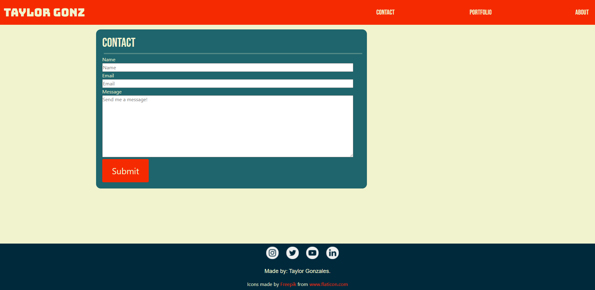
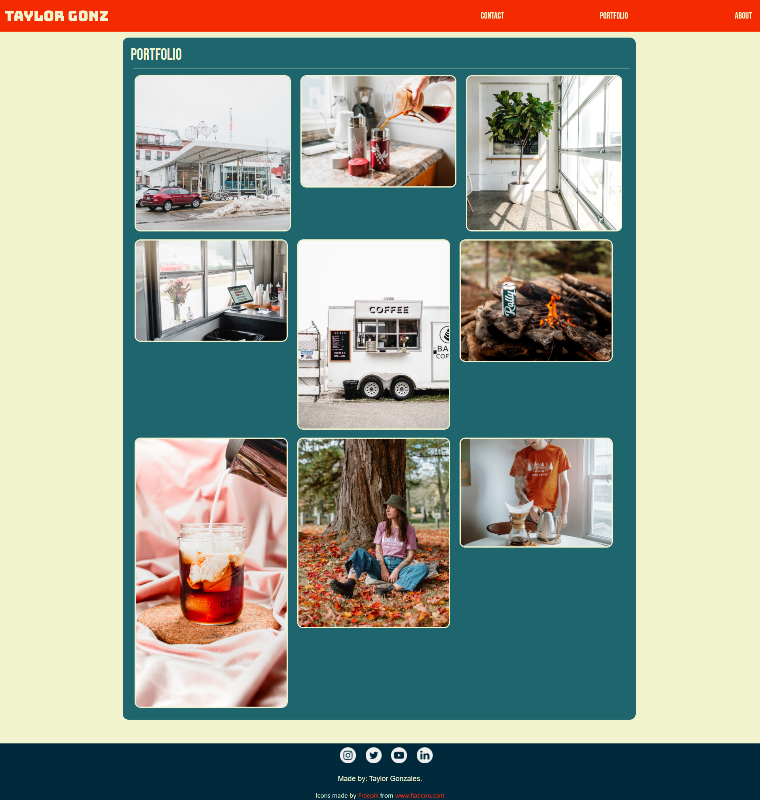

# Portfolio

## Here is my responsive porfolio!

Welcome to the read me of my first portfolio! I have, with the help of some bootstrap, built a responsive landing page for you to view!
I used many of the HTML and CSS skills we've learned to so far, along with my new best friend bootstrap!

Below I have a screenshots of the Website.

## Credits
Credit to [Mike Fearnley](https://michaelfearnley.com/) and [Scott Byers](https://github.com/switch120)

and the UNH Fullstack Coding Bootcamp

## Links 
Here is the link to the deployed site: https://taylorgonz.github.io/Portfolio/

## Contact

if you want to contact me for any more questions here are my links!

hello@taylorgonz.com
 
[Website](http://www.taylorgonz.com)

## Licensing
 [General Public License](https://opensource.org/licenses/GPL-2.0)